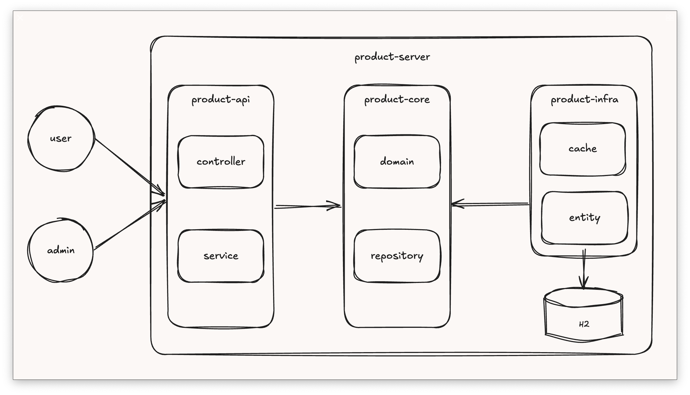
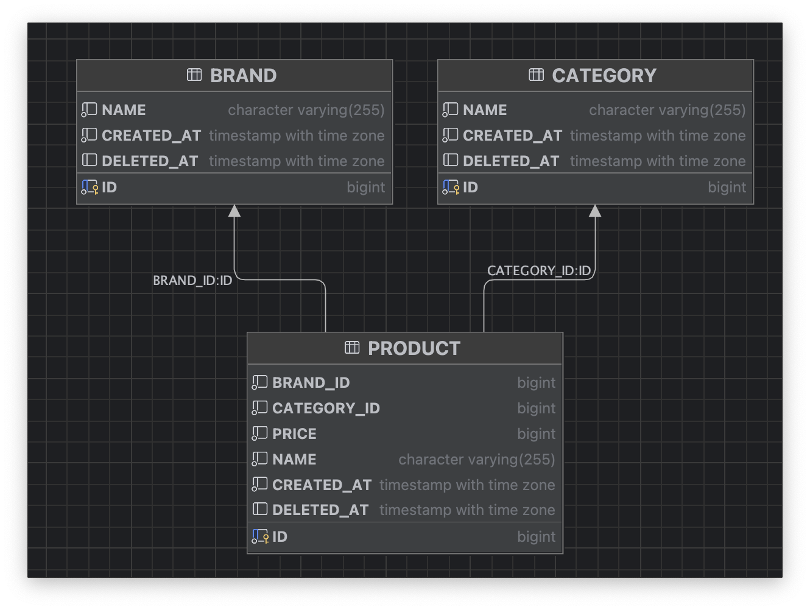
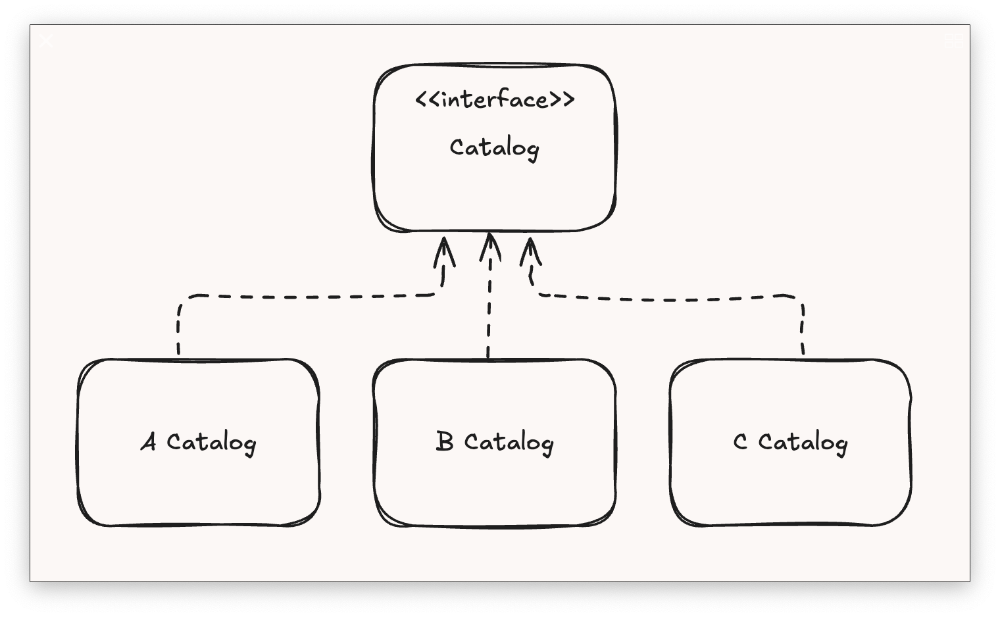
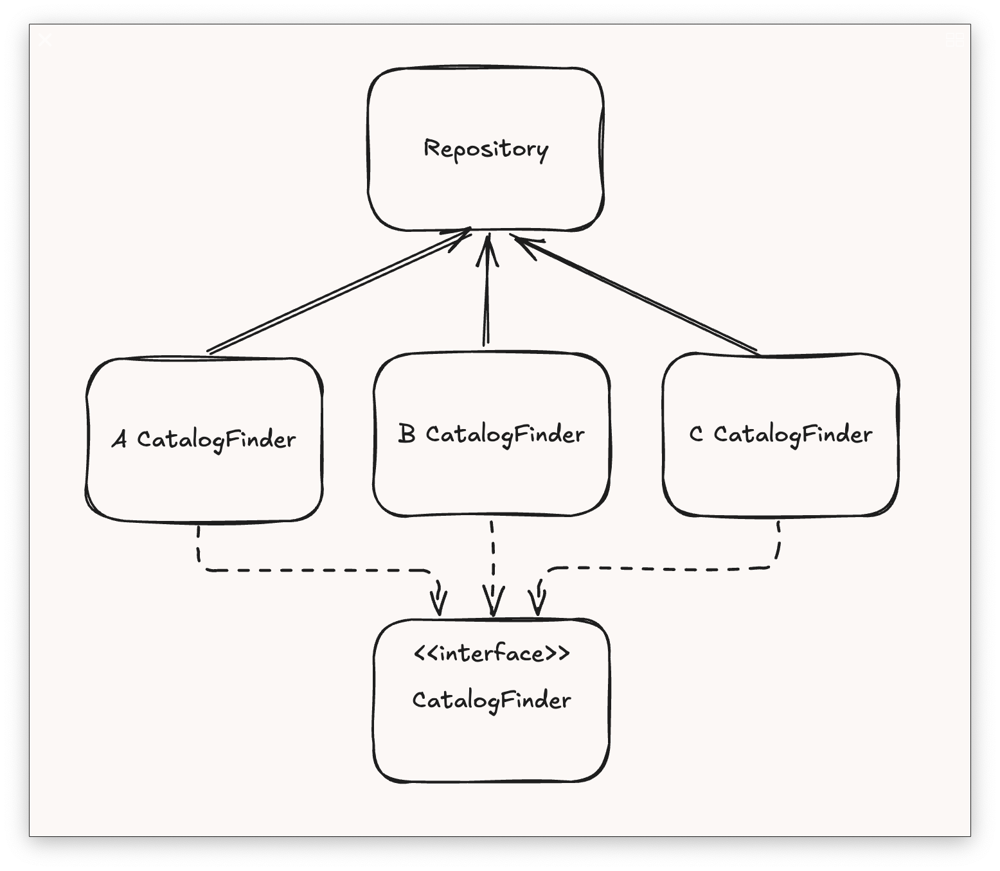
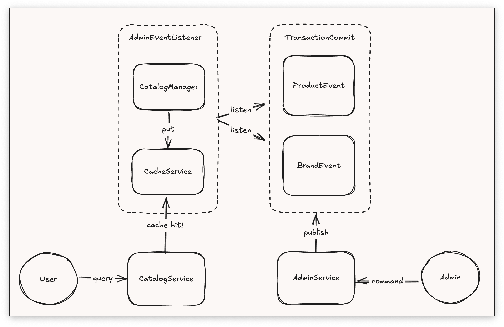
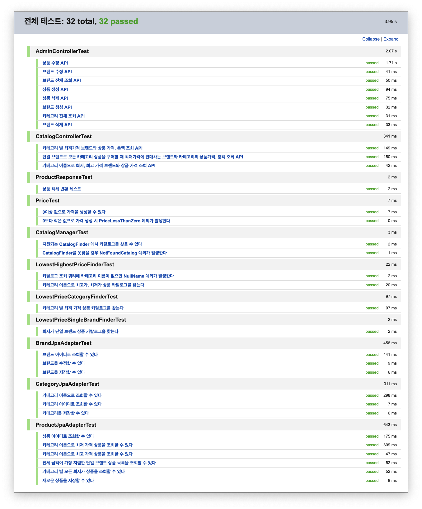

## 목차

- [📍프로젝트 개요](#프로젝트-개요)
    - [사용 기술](#사용-기술)
- [🚀실행 방법](#실행-방법)
- [📝API 명세](#api-명세)
- [🛠️시스템 아키텍처](#시스템-아키텍처)
    - [전체 구조](#전체-구조)
    - [모듈 구성](#모듈-구성)
    - [테이블 스키마](#테이블-스키마)
    - [주요 기능 및 구현 방식](#주요-기능-및-구현-방식)

## 프로젝트 개요

### 기능 설명

Kotlin + SpringBoot 기반의 상품을 관리 및 전시하는 기능을 가진 API 서버입니다.

다음 기능을 제공합니다.

유저

1. 카테고리 별 최저가격 상품 카탈로그 조회
2. 모든 카테고리를 포함하는 최저가격 브랜드 상품 카탈로그 조회
3. 카테고리 별 최저, 최고 가격 상품 카탈로그 조회

관리자

1. 카테고리 전체 조회
2. 브랜드 전체 조회
3. 브랜드 추가
4. 브랜드 수정
5. 브랜드 삭제
6. 상품 추가
7. 상품 수정
8. 상품 삭제

### 사용 기술

- **언어**
    - `Java 21`
    - `Kotlin 1.9.25`
    - `Gradle 8.7`
- **프레임워크**
    - `Spring Boot 3.4.2`
- **Web**
    - `Spring Web MVC`
- **DB**
    - `Spring Data JPA`
    - `H2 Database`
    - `kotlin-jdsl`
- **테스트**
    - `JUnit 5`
    - `Kotest`
    - `Rest Assured`

## 실행 방법

모든 명령어는 해당 프로젝트를 `git clone` 후 프로젝트 루트 디렉토리에서 실행합니다.

```shell
git clone https://github.com/ch-jooon/product-server.git
```

### 사전 준비

> 해당 API 서버는 `Java 21` 이상에서 실행됩니다.
>
> 다음 명령어를 통해 로컬 환경의 Java 버전을 확인합니다.
>
> ```shell
> java -version
> ```
>
> 📍 Java 버전에 상관 없이 실행하려면 [Docker 실행](#Docker-실행) 방법을 사용해 주세요.

해당 서버는 `8080` 포트를 사용합니다.

포트 충돌을 방지하기 위해 해당 포트를 사용하지 않는지 확인해주세요.

### Gradle 실행

`gradlew` 명령어를 통해 서버를 직접 실행합니다.

```shell
./gradlew :product-api:bootRun
```

혹은 `Makefile`을 통해 실행할 수 있습니다.

```shell
make run
```

### Docker 실행

> Docker 환경으로 실행하기 위해서는 로컬 환경에 `Docker`와 `Docker Compose`가 설치되어 있어야 합니다.

`docker-compose`를 통해 서버를 실행합니다.

```shell
docker-compose up -d
```

혹은 `Makefile` 을 통해 실행할 수 있습니다.

```shell
make up
```

### 테스트

`gradlew` 명령어를 통해 전체 테스트를 실행합니다.

```shell
./gradlew clean test
```

혹은 `Makefile`을 통해 실행할 수 있습니다.

```shell
make test
```

## API 명세

- [OpenAPI](openapi.yaml) 스펙의 명세를 제공합니다.

API 명세는 `SwaggerUI`를 통해 확인할 수 있습니다.

[🚀실행 방법](#실행-방법)을 통해 서버 실행 후

http://localhost:8080/docs/swagger-ui 로 접속하여 확인할 수 있습니다.


## 시스템 아키텍처

### 전체 구조

시스템의 전체적인 아키텍처는 `클린 아키텍처` 를 기반으로 설계되었습니다.

**도메인을 중심**으로 설계되어 비즈니스 로직과 인프라 로직을 명확하게 분리합니다. 또한, 조회 성능을 위해 **캐시**를 적용하고, **확장성**을 고려하여 설계되었습니다.



### 모듈 구성

해당 프로젝트는 `gradle` 멀티 모듈 프로젝트로 구성되어 있습니다.

도메인을 중심 설계를 위해 각 책임 별 모듈을 구성해 의존성을 명시적으로 분리시켰습니다.

다음과 같은 모듈로 구성됩니다.

```
├── product-api
├── product-core
└── product-infra
    └── product-infra-cache
    └── product-infra-jpa
```

각 모듈은 다음과 같은 역할을 수행합니다.

- `product-api`
    - 실행 가능한 API 서버 모듈입니다. (Executable JAR)
    - 외부 요청을 받아서 비즈니스 로직을 실행시키는 책임을 가집니다.
- `product-core`
    - 핵심 비즈니스 로직을 담당하는 책임을 가집니다.
    - 도메인과 관련된 유즈케이스, 서비스를 제공합니다.
- `product-infra`
    - 도메인 개념들을 실제 인프라를 통해 구현하는 책임을 가집니다.
    - `product-infra-jpa`: 도메인 객체를 JPA 엔티티로 변환하고 영속화하는 책임을 가집니다.
    - `product-infra-cache`: 캐시를 사용하여 조회 성능을 향상시키는 책임을 가집니다. 필요에 따라 다양한 캐시 인프라를 구현할 수 있습니다. (예: Redis, Caffeine 등)

### 테이블 스키마

테이블 스키마는 다음과 같이 구성되어 있습니다.



도메인의 유연성과 확장성을 고려하여, 상품과 브랜드, 카테고리 간의 DB 수준의 FK 제약 조건은 설정하지 않았습니다.

Entity 연관 관계에서도 직접 연관 관계를 설정하지 않고, id를 통한 간접 참조를 사용합니다.

```kotlin
@Entity
@Table(name = "product")
data class ProductEntity(
    @Id
    @GeneratedValue(strategy = GenerationType.IDENTITY)
    @Column(name = "id")
    val id: Long,
    // ...

    @Column(name = "category_id", nullable = false)
    val categoryId: Long,

    @Column(name = "brand_id", nullable = false)
    val brandId: Long,

    //...
)
```

위 같은 구조로 엔티티를 설계하고, 필요 시 DSL을 사용하여 명시적으로 `JOIN` 쿼리를 작성합니다.

데이터베이스 운영 편의성 및 유연한 엔티티 설계를 통해 도메인과 인프라의 의존성을 최소화합니다.

```kotlin
selectProjection().from(
    entity(ProductEntity::class),
    join(BrandEntity::class)
        .on(path(ProductEntity::brandId).eq(path(BrandEntity::id))),
    join(CategoryEntity::class)
        .on(path(ProductEntity::categoryId).eq(path(CategoryEntity::id))),
) // where 절 생략
```

### 주요 기능 및 구현 방식

#### 주요 도메인 설계

> 유저
> 1. 카테고리 별 최저가격 상품 조회
> 2. 모든 카테고리를 포함하는 최저가격 브랜드 상품 조회
> 3. 카테고리 별 최저, 최고 가격 상품 조회

위 요구사항에 따라 유저는 여러 상품 목록을 조회할 수 있습니다.

위 가치를 제공하기 위해 고민을 한 결과, 결국 유저는 **특정 목적**에 맞게 **전시된 상품 목록**을 조회하는 것이기 때문에, 상품 목록을 전시하는 `Catalog` 라는 도메인을 도출했습니다.

```kotlin
/**
 * Catalog(카탈로그)는 여러 상품(Product)을 특정 목적에 맞게 전시(Display)하기 위한 그룹의 개념입니다.
 */
interface Catalog {
    val type: CatalogType
    val source: List<Product>
    //...
}
```

`Catalog` 인터페이스는 타입에 따라 다양한 카탈로그 구현체를 가질 수 있습니다.



그리고 각 카탈로그를 조회하는 책임을 가진 `CatalogFinder`를 통해 실제 상품 목록을 조회합니다.

`CatalogFinder`는 `Repository`를 통해 실제 상품 데이터를 조회합니다.



```kotlin
/**
 * 카탈로그 관련 로직을 처리하는 객체입니다.
 *
 * @property finders: 여러 종류의 카탈로그를 처리하기 위해 CatalogFinder 인터페이스를 구현한 객체들을 주입받아 사용합니다.
 */
@Component
class CatalogManager(
    private val finders: List<CatalogFinder<*>>,
) {
    private val catalogMap: Map<CatalogType, CatalogFinder<*>> = finders.associateBy { it.supportType }

    fun findCatalog(query: CatalogQuery): Catalog {
        val finder = catalogMap[query.type]
            ?: throw ProductException.NotFoundCatalog()

        return finder.findCatalog(query)
    }
}
```

`OCP(개방 폐쇄 원칙)`를 지키기 위해 `Strategy Pattern` 을 사용하여 다양한 카탈로그를 추가할 수 있도록 확장 가능한 유연한 구조로 설계했습니다.

#### 쿼리

조회 기능 중 `전체 금액이 가장 저렴한 단일 브랜드 상품 목록 조회` 기능을 구현할 때,
단일 쿼리를 사용하지 않고 필요한 개별 쿼리로 나누어 조회했습니다.

복잡한 쿼리를 단일 쿼리로 작성하는 것보다, 여러 개의 단순한 쿼리로 나누어 작성하는 것이 가독성이 좋고 유지보수하기 쉽다고 생각했습니다.

```kotlin
    override fun findMinTotalPriceBySingleBrand(): List<Product> {
    // 1. 전체 카테고리 수 조회
    val totalCategoryCount = categoryJpaRepository.count()

    // 2. 브랜드, 카테고리 별 최저 가격 조회
    val minPriceBrandProjection = jpaRepository.findAll {
        selectNew<BrandCategoryMinPriceProjection>(
            path(ProductEntity::brandId), // 브랜드 아이디
            path(ProductEntity::categoryId), // 카테고리 아이디
            min(path(ProductEntity::price)), // 최저 가격
        ).from(
            entity(ProductEntity::class),
        ).groupBy(
            path(ProductEntity::brandId),
            path(ProductEntity::categoryId),
        )
    }

    // 3. 전체 카테고리에 상품이 존재하는 가장 저렴한 브랜드 아이디 추출
    val lowestPriceBrandId = minPriceBrandProjection.toLowestTotalPriceBrandId(totalCategoryCount)

    // 4. 3번에서 추출된 브랜드 아이디로 상품 목록 조회
    return jpaRepository.findAll {
        //..생략
        whereAnd(
            path(ProductEntity::brandId).eq(value(lowestPriceBrandId)),
        )
    }.mapNotNull { it?.toDomain() }
}
```

조회를 위해 데이터베이스 쿼리를 3번 하지만, 각 쿼리는 단순하고 명확함을 주요 목적으로 작성했습니다.

하지만 이런 방식은 데이터 베이스 성능에 부정적인 영향을 미칠 수 있습니다. 그렇기 때문에
`캐싱`을 통해 데이터 베이스 부하를 줄이고 조회 성능을 개선하는 방향을 고려했습니다.

#### 캐싱

캐싱 설계는 다음과 같습니다.



핵심 캐시 서비스는 `product-core` 모듈에 위치하고 있습니다.

AOP 방식의 `@Cacheable` 어노테이션이 아닌 필요한 부분에 유연하게 캐시를 적용할 수 있도록 코틀린의 함수형 프로그래밍을 활용했습니다.

```kotlin
interface CacheService {
    fun <T> get(option: CacheOption): T?
    fun <T> put(option: CacheOption, value: T)

    fun <T> getOrPut(option: CacheOption, block: () -> T): T {
        return get(option) ?: run {
            block().also { put(option, it) }
        }
    }
}
```

AOP 프록시 기반의 어노테이션은 캐시 키를 문자열로 작성해야해서 실수가 발생할 수 있고, 내부 메서드에는 적용할 수 없는 제약이 있습니다.

따라서 함수형 스타일의 캐싱 로직을 적용했습니다.

```kotlin
@Service
class CatalogService(
    private val catalogManager: CatalogManager,
    private val cacheService: CacheService,
) {
    @Transactional(readOnly = true)
    fun getCatalog(query: CatalogQuery): Catalog {
        val cacheOption = query.getCacheOption()
        return cacheService.getOrPut(cacheOption) { // 함수형 캐싱
            catalogManager.findCatalog(query)
        }
    }
}
```

위와 방식으로 캐시를 적용해서 캐시 키를 명확하게 작성할 수 있고, 캐시를 적용할 메서드에 유연하게 적용했습니다.

캐시 갱신은 **관리자**의 상품, 브랜드 트랜잭션에서 `ApplicationEventPublicher` 를 통해 애플리케이션 이벤트를 발행하고, 트랜잭션이 정상 종료되면
`@TransactionalEventListener`를 통해 캐시를 갱신합니다.

관리자의 상품 추가, 수정, 삭제 시 캐싱된 카탈로그를 갱신시킵니다.

```kotlin
// AdminService
@Transactional
fun updateProduct(id: Long, request: AdminProductUpdateRequest): Product {
    val changed = productRepository.findById(id)
        .run { request.apply(this) }
        .run { productRepository.save(this) }

    ProductEvent.Updated(changed.id).also {
        eventPublisher.publishEvent(it) // 이벤트 발행
    }
    return changed
}

// AdminEventListener
@Async("catalogCacheExecutor")
@TransactionalEventListener(phase = TransactionPhase.AFTER_COMMIT)
fun listenProductEvent(event: Product) {
    refreshCache() // 캐시 갱신
}
```

#### 테스트

주요 기능에 대한 모든 단위 테스트 및 통합 테스트를 작성했습니다.


